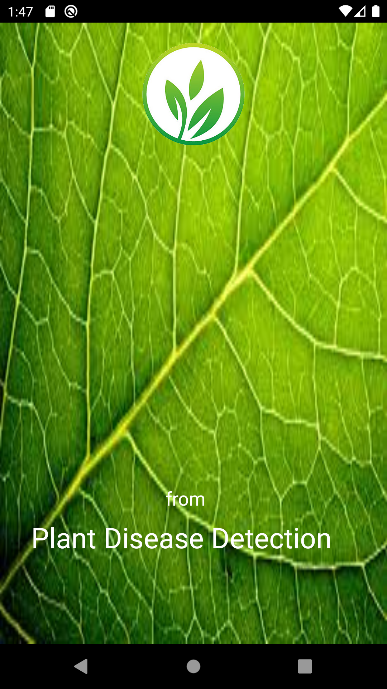

# Plant Disease Detection Android App
This is an app through which we can detect diseases in plants by capturing their images.

## Contributing
Pull requests are welcome. For major changes, please open an issue first to discuss what you would like to change.

Please make sure to update tests as appropriate.

##  IMAGES

## Created By
[aman05382](https://github.com/aman05382) [Yadav99](https://github.com/Yadav99) [ramtekerohit](https://github.com/ramtekerohit)

